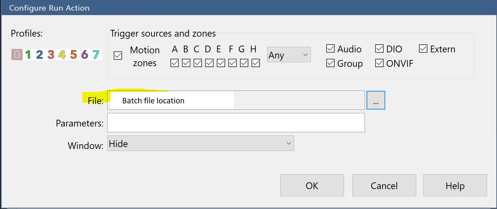

# pushover_blueiris_alert with image

Send BlueIris Alert image through pushover.

Installation:
1. Save the python script and batch file in your PC
2. change the blueIris config like below
3. Camera settings:

4. Alert settings:

5. Windows Service settings:

